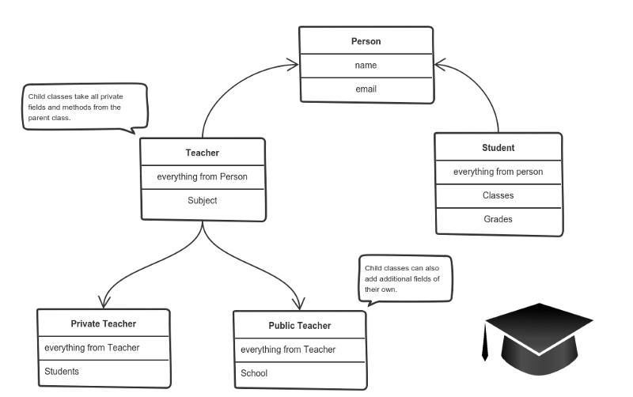
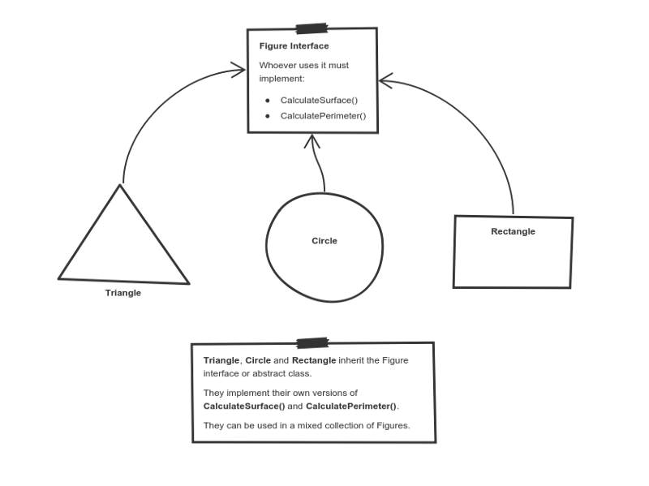

# Typescript-Solid
Learning the SOLID principles using Typescript and Parcel.

# SOLID TYPESCRIPT

Well, before we can dive in to this, it's important to understand that we are dealing with Object-Oriented-Programming here.
So I think it's necessary to go over the four pillars of Object-Oriented-Programming first, then we will attempt the SOLID PRINCIPLES.
I have been reading up on the four pillars these past days as well as gotten a thorough explanation from the coaches.
Now it's time to explain this concept in this README file to make sure/check if I really did understand all of it.
If I'm able to explain the four pillars to somebody who has no background in this whatsoever or let's say a 5-year-old,
I think we can agree that we accomplished our mission!

So Javascript is a multi-paradigm language and can be written following different programming paradigms.
A programming paradigm is essentially a bunch of rules that you follow when writing code, to help you solve a particular problem.
That's what the four pillars are. They're software design principles to help you write clean Object-Oriented code.

## The four pillars of OOP are: 

**1. Abstraction**
**2. Encapsulation**
**3. Inheritance**
**4. Polymorphism**

### Abstraction

In object-oriented design, programs often extremely large. Separate objects communicate with each other a lot.
So imagine maintaining a codebase like this for years, with some changes along the way. It's difficult.
Abstraction is a concept which helps in this regard. 

Think - a coffee machine, it does a lot of stuff and makes
noises under the hood. All you have to do is put coffee and press a button. Preferably, this mechanism should be easy to use
and rarely change over time. 

This principle is all about hiding away the "ugly parts" of your code.
Going further on our example of the coffee machine, below you can find a great example which I found browsing:

How to Create it With Abstraction

    Have a button with the title "Make coffee"

How to Create it Without Abstraction

    Have a button with the title "Boil the water"
    Have a button with the title "Add the cold water to the kettle"
    Have a button with the title "Add 1 spoon of ground coffee to a clean cup"
    Have a button with the title "Clean any dirty cups"
    And all the other buttons

### Encapsulation

Say we have a program. It has a few logically different objects which communicate with each other — according to the rules defined in the program.

Encapsulation is achieved when each object keeps its state private, inside a class. Other objects don’t have direct access to this state. Instead, they can only call a list of public functions — called methods.

So, the object manages its own state via methods — and no other class can touch it unless explicitly allowed. If you want to communicate with the object, you should use the methods provided. But (by default), you can’t change the state.

Let’s say we’re building a tiny Sims game. There are people and there is a cat. They communicate with each other. We want to apply encapsulation, so we encapsulate all “cat” logic into a Cat class. It may look like this:

You can feed the cat. But you can’t directly change how hungry the cat is.

Here the “state” of the cat is the private variables: mood, hungry and energy. It also has a private method meow(). It can call it whenever it wants, the other classes can’t tell the cat when to meow.

What they can do is defined in the public methods sleep(), play() and feed(). Each of them modifies the internal state somehow and may invoke meow(). Thus, the binding between the private state and public methods is made.

This is encapsulation.

### Inheritance

OK, we saw how encapsulation and abstraction can help us develop and maintain a big codebase.

But do you know what is another common problem in OOP design?

Objects are often very similar. They share common logic. But they’re not entirely the same. Ugh…

So how do we reuse the common logic and extract the unique logic into a separate class? One way to achieve this is inheritance.

It means that you create a (child) class by deriving from another (parent) class. This way, we form a hierarchy.

The child class reuses all fields and methods of the parent class (common part) and can implement its own (unique part).

For example:

A private teacher is a type of teacher. And any teacher is a type of Person.

If our program needs to manage public and private teachers, but also other types of people like students, we can implement this class hierarchy.

This way, each class adds only what is necessary for it while reusing common logic with the parent classes.

### Polymorphism

We’re down to the most complex word! Polymorphism means “many shapes” in Greek.

So we already know the power of inheritance and happily use it. But there comes this problem.

Say we have a parent class and a few child classes which inherit from it. Sometimes we want to use a collection — for example a list — which contains a mix of all these classes. Or we have a method implemented for the parent class — but we’d like to use it for the children, too.

This can be solved by using polymorphism.

Simply put, polymorphism gives a way to use a class exactly like its parent so there’s no confusion with mixing types. But each child class keeps its own methods as they are.

This typically happens by defining a (parent) interface to be reused. It outlines a bunch of common methods. Then, each child class implements its own version of these methods.

Any time a collection (such as a list) or a method expects an instance of the parent (where common methods are outlined), the language takes care of evaluating the right implementation of the common method — regardless of which child is passed.

Take a look at a sketch of geometric figures implementation. They reuse a common interface for calculating surface area and perimeter:

Triangle, Circle, and Rectangle now can be used in the same collection

Having these three figures inheriting the parent Figure Interface lets you create a list of mixed triangles, circles, and rectangles. And treat them like the same type of object.

Then, if this list attempts to calculate the surface for an element, the correct method is found and executed. If the element is a triangle, triangle’s CalculateSurface() is called. If it’s a circle — then circle’s CalculateSurface() is called. And so on.

If you have a function which operates with a figure by using its parameter, you don’t have to define it three times — once for a triangle, a circle, and a rectangle.

You can define it once and accept a Figure as an argument. Whether you pass a triangle, circle or a rectangle — as long as they implement CalculateParamter(), their type doesn’t matter.